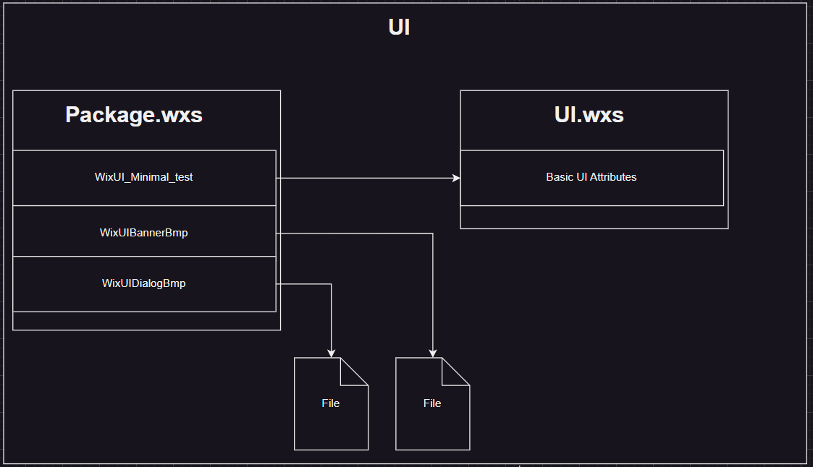
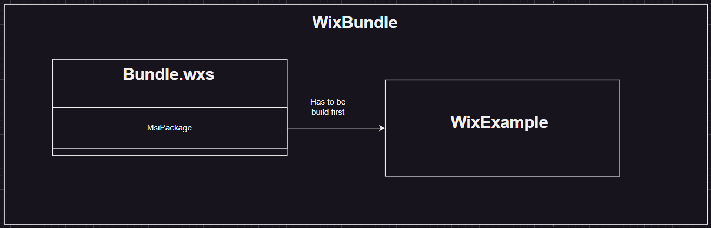
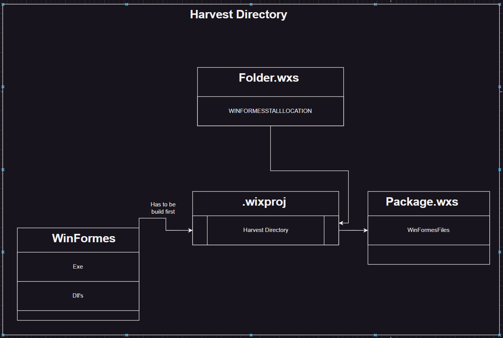

# Wix Toolset example

This Project basic examples on how to use wix. Examples covered here are

- Wix MSI Builder
- Wix Bundle
- Custom Actions
- WixUI
- Harvest Directory

At each files there are comments that explain what has been done. This Readme contains some general knowledge.

## Components

MSI works with components. A component groups multiple resources, ensuring they are always installed or uninstalled together.
This prevents inconsistencies and ensures a machine always has all the necessary parts of a feature.

In WiX, components are defined using the Component element, which contains child elements like File and RegistryValue.

## References

Similar to how code is split into separate files, WiX code can be structured into multiple files for better organization and maintainability.

WiX uses references to link elements in different files.
For example, the ComponentGroupRef element references a ComponentGroup with the same ID.
References are typically expressed using elements ending in Ref (e.g., ComponentGroupRef, DirectoryRef) or attributes ending in Ref (e.g., BinaryRef, FileRef).

## Groups

WiX provides additional structuring capabilities beyond those offered by MSI.
Component groups (ComponentGroup) allow grouping components to avoid code duplication and improve organization.
During the build process, all references are resolved, and components are included in the appropriate features.

## Burn:

Burn is a bootstrapper that allows you to chain multiple installers, download prerequisites, and customize the user interface.

## MSBuild Variable access

For commen MSBuild properties see [here](https://learn.microsoft.com/en-us/visualstudio/msbuild/common-msbuild-project-properties?view=vs-2022)

$(variable_name)

## Add packages

Add name to xmlns:ui="http://wixtoolset.org/schemas/v4/wxs/ui" element and install nuget package

# Tasks

## File creation

Add another file to the installtion directory.

## Read registry value

Read out some value from the registry and use it as a condition for a custom action.

